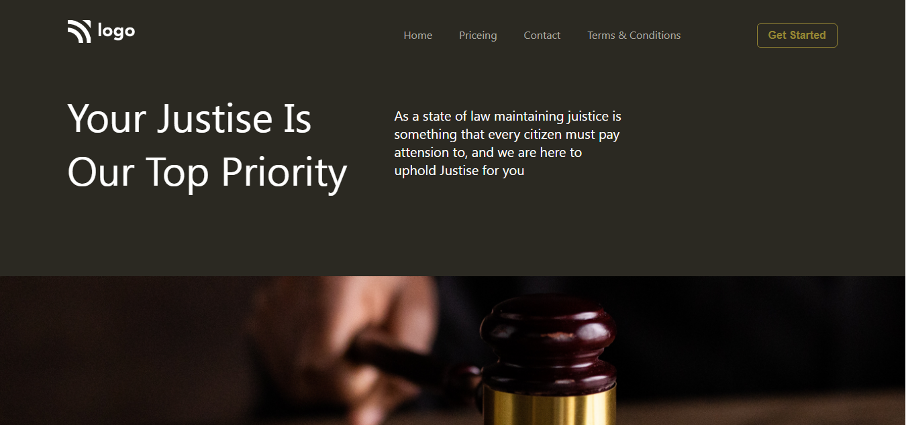

# Project - 03

### Your Justis (Landing Page)

---

## About project
---

This Project Is Created Using Html & CSS Only. Various Html & CSS Property are Used To Make This Landing Page Delightful.
This Page Have A Separate Content Part And A Image Part. Content Part Have A Suitable  Background Color Thats's Match A Image Very Well.

---

## Learning Experience
---
With the help of this project, I learned how to create a gorgeous landing Page by Using a CSS Property to Alter the Background. I've learned more about CSS while creating this page.

## How Much Time I Took To Finish This Project...? 
>Overall it Took me a  `4 hours` to Commplete This Project, Yes Try & Erorr, And So much to Learn And Explore.

---

##  Special Thanks To : [Hitesh Choudhary Sir](https://www.instagram.com/hiteshchoudharyofficial/?hl=en)  And [Ineuron](https://ineuron.ai/course/Full-Stack-Javascript-Web-Developer)

>Thank You Very Much For This Amazing Course.

---

## Screenshot 

[Live Link](https://majestic-granita-650443.netlify.app/)

---

>## Who Am I ?

>My Name Is Karan I am A Learner Who is Interested in Sharing Knowledge About The Skills That I'm Developing to Become A Full-Stack Web Developer.

>## Check Out My Work on 

>[Netlify](https://app.netlify.com/teams/karan9846/overview?_ga=2.175703073.206776847.1659963657-634189433.1659791041)

>[FindCoder](https://www.findcoder.io/u/karan18)

>[hashnode](https://hashnode.com/@karan787)

>Let's get Connected [@karanjaria](https://www.instagram.com/karanjaria/?hl=en)